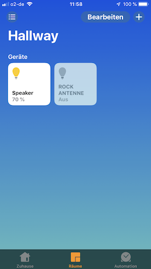
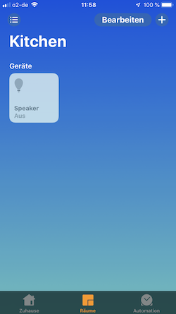
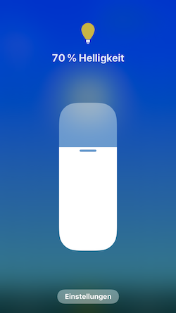
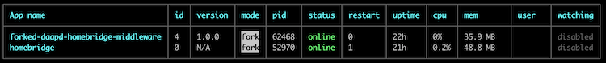

For use in conjunction with
* [forked-daapd](https://github.com/ejurgensen/forked-daapd)
* [Shairport Sync](https://github.com/mikebrady/shairport-sync) (Optional)
* [Homebridge](https://github.com/nfarina/homebridge)
* [homebridge-better-http-rgb](https://github.com/jnovack/homebridge-better-http-rgb)

to play your favourite radio stations with just a voice command and control multiple output devices.

Examples:

* "Hey Siri, start ROCK ANTENNE"
* "Hey Siri, start [YOUR_FAVOURITE_RADIO_STATION]"
* "Hey Siri, turn on Speaker in Hallway"
* "Hey Siri, turn off [SPEAKER_NAME] in [ROOM_NAME]"





# Overview

This package acts like a standalone proxy server which endpoints get to be called by the homebridge-better-http-rgb plugin.
The plugin is responsible for then advertising the various accessories to homebridge (see [config.json](config/homebridge/config.json)).
The middleware is using the amazing [forked-daapd JSON API](https://github.com/ejurgensen/forked-daapd/blob/master/README_JSON_API.md)
to control the various accessories and redirect their actions to forked-daapd. Therefore it is possible to advertise almost
any forked-daapd action to HomeKit.

# Prerequisites

* [Node.js](https://nodejs.org/en/) >= v10.15.1 with [npm](https://www.npmjs.com) >= v6.4.1
* [forked-daapd](https://github.com/ejurgensen/forked-daapd) >= v26.4 available in your local network
* [homebridge](https://homebridge.io) >= v0.4.46 with [homebridge-better-http-rgb](https://www.npmjs.com/package/homebridge-better-http-rgb) >= v2.0.0 plugin available in your local network
* At least one output device (AirPlay, Chromecast, etc) in your local network which can be controlled by forked-daapd
* At least one playlist with an internet radio stream url in it, available in your forked-daapd library

# Installation and execution

## Option 1: Installing as npm dependency

```bash
$ mkdir forked-daapd-homebridge-middleware
$ npm init
$ npm install --save forked-daapd-homebridge-middleware
```

For the `npm init` command answer all questions with [ENTER] key.

### Configuration
See [configuration](#configuration).

### Run as npm dependency

```bash
$ cd forked-daapd-homebridge-middleware
$ npx forked-daapd-homebridge-middleware
```

## Option 2: Installing as separate project

```bash
$ git clone https://github.com/moecre/forked-daapd-homebridge-middleware.git
$ cd forked-daapd-homebridge-middleware
$ npm install
```

### Configuration
See [configuration](#configuration).

### Run as separate project

```bash
$ cd forked-daapd-homebridge-middleware
$ npm start
```

## Running with PM2

In production I strongly advise you to use a process manager like [PM2](http://pm2.keymetrics.io) to run forked-daapd-homebridge-middleware.
In case anything unexpected happens the middleware is going to be restarted automatically by PM2.



By the way, that's a good solution for your Homebridge process, too.

# <a name="configuration"></a>Configuration

## Create forked-daapd-homebridge-middleware configuration file

Copy the distributed [index.dist.json](config/index.dist.json) to index.json in the same directory and change the file
according to your setup and needs.

| Param   | Description                       |
|---------|-----------------------------------|
| baseUrl | URL to your forked-daapd JSON API |

## Adding your accessories to Homebridge

Please take a look at the provided [config.json](config/homebridge/config.json) for examples. In general your Homebridge
configuration file is located in `~/.homebridge/config.json`.

### Radio station

Please replace placeholders, eg. `{NAME YOUR RADIO STATION}` for `ROCK ANTENNE`. Keep in mind that the name must
be unique over all your accessories (UUID in Homebridge).

```json
{
  "accessory": "HTTP-RGB",
  "name": "{NAME YOUR RADIO STATION}",
  "service": "Light",
  "switch": {
    "status": "http://{HOSTNAME ON WHICH FORKED-DAAPD-HOMEBRIDGE-MIDDLEWARE IS RUNNING}:3000/playlists/{URL ENCODED NAME OF THE PLAYLIST IN FORKED-DAAPD}",
    "powerOn": "http://{HOSTNAME ON WHICH FORKED-DAAPD-HOMEBRIDGE-MIDDLEWARE IS RUNNING}:3000/playlists/{URL ENCODED NAME OF THE PLAYLIST IN FORKED-DAAPD}/play",
    "powerOff": "http://{HOSTNAME ON WHICH FORKED-DAAPD-HOMEBRIDGE-MIDDLEWARE IS RUNNING}:3000/player/stop"
  }
}
```

### Speaker (output device)

Please replace placeholders, eg. `{NAME YOUR SPEAKER}` for `Hallway speaker`. Keep in mind that the name must be 
unique over all your accessories (UUID in Homebridge).

```json
{
  "accessory": "HTTP-RGB",
  "name": "{NAME YOUR SPEAKER}",
  "service": "Light",
  "switch": {
    "status": "http://{HOSTNAME ON WHICH FORKED-DAAPD-HOMEBRIDGE-MIDDLEWARE IS RUNNING}:3000/outputs/{URL ENCODED NAME OF OUTPUT DEVICE IN FORKED-DAAPD}",
    "powerOn": "http://{HOSTNAME ON WHICH FORKED-DAAPD-HOMEBRIDGE-MIDDLEWARE IS RUNNING}:3000/outputs/{URL ENCODED NAME OF OUTPUT DEVICE IN FORKED-DAAPD}/state/on",
    "powerOff": "http://{HOSTNAME ON WHICH FORKED-DAAPD-HOMEBRIDGE-MIDDLEWARE IS RUNNING}:3000/outputs/{URL ENCODED NAME OF OUTPUT DEVICE IN FORKED-DAAPD}/state/off"
  },
  "brightness": {
     "status": "http://{HOSTNAME ON WHICH FORKED-DAAPD-HOMEBRIDGE-MIDDLEWARE IS RUNNING}:3000/outputs/{URL ENCODED NAME OF OUTPUT DEVICE IN FORKED-DAAPD}/volume",
     "url": "http://{HOSTNAME ON WHICH FORKED-DAAPD-HOMEBRIDGE-MIDDLEWARE IS RUNNING}:3000/outputs/{URL ENCODED NAME OF OUTPUT DEVICE IN FORKED-DAAPD}/volume/%s"
  }
}
```

## How to create playlists in your forked-daapd server

Please have a look [here](https://github.com/ejurgensen/forked-daapd#playlists-and-internet-radio).